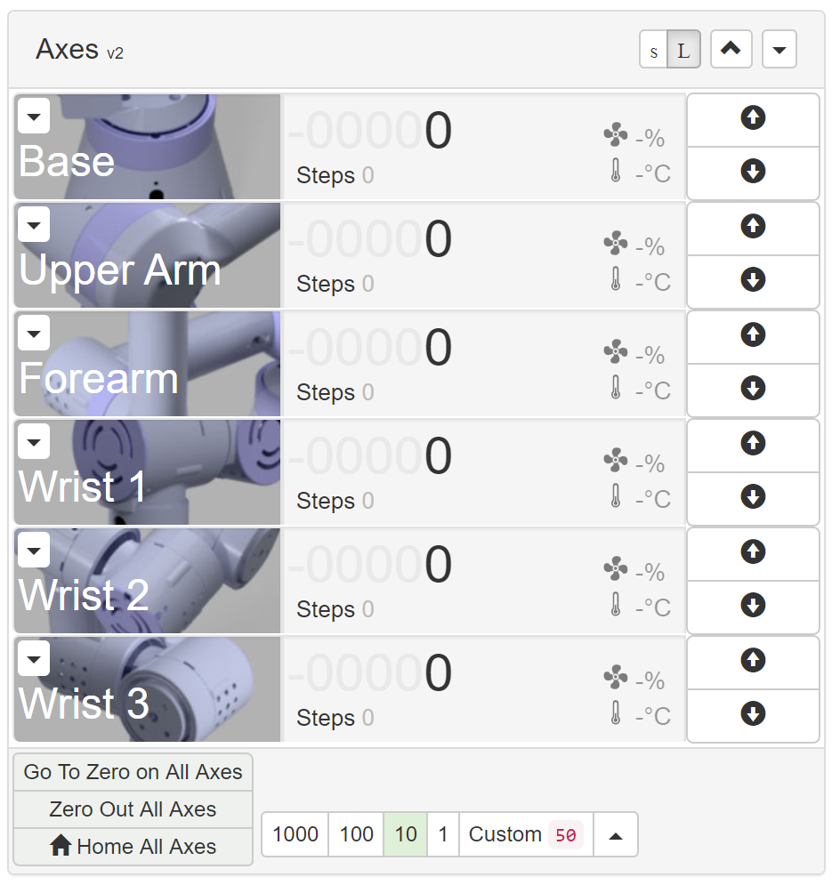

# com-chilipeppr-widget-robot-axes
This widget lets you see the axes information for the 6 actuators on a robot arm plus grippers or other end units. It enables you to jog, home, and change units.



## ChiliPeppr Widget / Robot Arm Axes

All ChiliPeppr widgets/elements are defined using cpdefine() which is a method
that mimics require.js. Each defined object must have a unique ID so it does
not conflict with other ChiliPeppr widgets.

| Item                  | Value           |
| -------------         | ------------- | 
| ID                    | com-chilipeppr-widget-robot-axes |
| Name                  | Widget / Robot Arm Axes |
| Description           | This widget lets you see the axes information for the 6 actuators on a robot arm plus grippers or other end units. It enables you to jog, home, and change units. |
| chilipeppr.load() URL | https://raw.githubusercontent.com/chilipeppr/widget-robot-axes/master/auto-generated-widget.html |
| Edit URL              | (Local dev. No edit URL) |
| Github URL            | https://github.com/chilipeppr/widget-robot-axes |
| Test URL              | http://localhost:9005/widget.html |

## Example Code for chilipeppr.load() Statement

You can use the code below as a starting point for instantiating this widget 
inside a workspace or from another widget. The key is that you need to load 
your widget inlined into a div so the DOM can parse your HTML, CSS, and 
Javascript. Then you use cprequire() to find your widget's Javascript and get 
back the instance of it.

```javascript
// Inject new div to contain widget or use an existing div with an ID
$("body").append('<' + 'div id="myDivWidgetRobotAxes"><' + '/div>');

chilipeppr.load(
  "#myDivWidgetRobotAxes",
  "https://raw.githubusercontent.com/chilipeppr/widget-robot-axes/master/auto-generated-widget.html",
  function() {
    // Callback after widget loaded into #myDivWidgetRobotAxes
    // Now use require.js to get reference to instantiated widget
    cprequire(
      ["inline:com-chilipeppr-widget-robot-axes"], // the id you gave your widget
      function(myObjWidgetRobotAxes) {
        // Callback that is passed reference to the newly loaded widget
        console.log("Widget / Robot Arm Axes just got loaded.", myObjWidgetRobotAxes);
        myObjWidgetRobotAxes.init();
      }
    );
  }
);

```

## Publish

This widget/element publishes the following signals. These signals are owned by this widget/element and are published to all objects inside the ChiliPeppr environment that listen to them via the 
chilipeppr.subscribe(signal, callback) method. 
To better understand how ChiliPeppr's subscribe() method works see amplify.js's documentation at http://amplifyjs.com/api/pubsub/

  <table id="com-chilipeppr-elem-pubsubviewer-pub" class="table table-bordered table-striped">
      <thead>
          <tr>
              <th style="">Signal</th>
              <th style="">Description</th>
          </tr>
      </thead>
      <tbody>
      <tr><td colspan="2">(No signals defined in this widget/element)</td></tr>    
      </tbody>
  </table>

## Subscribe

This widget/element subscribes to the following signals. These signals are owned by this widget/element. Other objects inside the ChiliPeppr environment can publish to these signals via the chilipeppr.publish(signal, data) method. 
To better understand how ChiliPeppr's publish() method works see amplify.js's documentation at http://amplifyjs.com/api/pubsub/

  <table id="com-chilipeppr-elem-pubsubviewer-sub" class="table table-bordered table-striped">
      <thead>
          <tr>
              <th style="">Signal</th>
              <th style="">Description</th>
          </tr>
      </thead>
      <tbody>
      <tr><td colspan="2">(No signals defined in this widget/element)</td></tr>    
      </tbody>
  </table>

## Foreign Publish

This widget/element publishes to the following signals that are owned by other objects. 
To better understand how ChiliPeppr's subscribe() method works see amplify.js's documentation at http://amplifyjs.com/api/pubsub/

  <table id="com-chilipeppr-elem-pubsubviewer-foreignpub" class="table table-bordered table-striped">
      <thead>
          <tr>
              <th style="">Signal</th>
              <th style="">Description</th>
          </tr>
      </thead>
      <tbody>
      <tr valign="top"><td>/com-chilipeppr-widget-robot-axes/com-chilipeppr-widget-cayenn/sendToDeviceNameViaTcp</td><td>We publish to the Cayenn widget so it can send jog values to the Cayenn device by name like Wrist1, Wrist2, Wrist3, etc.</td></tr>    
      </tbody>
  </table>

## Foreign Subscribe

This widget/element publishes to the following signals that are owned by other objects.
To better understand how ChiliPeppr's publish() method works see amplify.js's documentation at http://amplifyjs.com/api/pubsub/

  <table id="com-chilipeppr-elem-pubsubviewer-foreignsub" class="table table-bordered table-striped">
      <thead>
          <tr>
              <th style="">Signal</th>
              <th style="">Description</th>
          </tr>
      </thead>
      <tbody>
      <tr valign="top"><td>/com-chilipeppr-widget-robot-axes/com-chilipeppr-widget-cayenn/onRecvFromDeviceName</td><td>We subscribe to the Cayenn widget so when it tells us the step value of axes like Wrist1, Wrist2, Wrist3, etc we can update our widget.</td></tr>    
      </tbody>
  </table>

## Methods / Properties

The table below shows, in order, the methods and properties inside the widget/element.

  <table id="com-chilipeppr-elem-methodsprops" class="table table-bordered table-striped">
      <thead>
          <tr>
              <th style="">Method / Property</th>
              <th>Type</th>
              <th style="">Description</th>
          </tr>
      </thead>
      <tbody>
      <tr valign="top"><td>id</td><td>string</td><td>"com-chilipeppr-widget-robot-axes"</td></tr><tr valign="top"><td>url</td><td>string</td><td>"https://raw.githubusercontent.com/chilipeppr/widget-robot-axes/master/auto-generated-widget.html"</td></tr><tr valign="top"><td>fiddleurl</td><td>string</td><td>"(Local dev. No edit URL)"</td></tr><tr valign="top"><td>githuburl</td><td>string</td><td>"https://github.com/chilipeppr/widget-robot-axes"</td></tr><tr valign="top"><td>testurl</td><td>string</td><td>"http://localhost:9005/widget.html"</td></tr><tr valign="top"><td>name</td><td>string</td><td>"Widget / Robot Arm Axes"</td></tr><tr valign="top"><td>desc</td><td>string</td><td>"This widget lets you see the axes information for the 6 actuators on a robot arm plus grippers or other end units. It enables you to jog, home, and change units."</td></tr><tr valign="top"><td>publish</td><td>object</td><td>Please see docs above.</td></tr><tr valign="top"><td>subscribe</td><td>object</td><td>Please see docs above.</td></tr><tr valign="top"><td>foreignPublish</td><td>object</td><td>Please see docs above.</td></tr><tr valign="top"><td>foreignSubscribe</td><td>object</td><td>Please see docs above.</td></tr><tr valign="top"><td>init</td><td>function</td><td>function () 
</td></tr><tr valign="top"><td>setupOnRecvFromDeviceName</td><td>function</td><td>function() 
<br><br>Setup to get incoming data from Cayenn devices by their name.</td></tr><tr valign="top"><td>onRecvFromDeviceName</td><td>function</td><td>function(payload) 
<br><br>Called when we get incoming data from Cayenn devices by their name.</td></tr><tr valign="top"><td>setAxesStepVal</td><td>function</td><td>function(name, val) 
<br><br>Set the axes value by name</td></tr><tr valign="top"><td>createDomAxes</td><td>function</td><td>function() 
</td></tr><tr valign="top"><td>onJogFwdClick</td><td>function</td><td>function(evt) 
</td></tr><tr valign="top"><td>onJogRevClick</td><td>function</td><td>function(evt) 
</td></tr><tr valign="top"><td>titleCase</td><td>function</td><td>function(str) 
</td></tr><tr valign="top"><td>pencilSetup</td><td>function</td><td>function() 
</td></tr><tr valign="top"><td>pencilOnMouseover</td><td>function</td><td>function(evt) 
</td></tr><tr valign="top"><td>pencilOnMouseout</td><td>function</td><td>function(evt) 
</td></tr><tr valign="top"><td>pencilClick</td><td>function</td><td>function(evt) 
</td></tr><tr valign="top"><td>pencilCtr</td><td>number</td><td></td></tr><tr valign="top"><td>pencilKeypress</td><td>function</td><td>function(evt) 
</td></tr><tr valign="top"><td>pencilHide</td><td>function</td><td>function(tgtEl) 
</td></tr><tr valign="top"><td>initAs3dPrinting</td><td>function</td><td>function () 
</td></tr><tr valign="top"><td>setupShowHideWcsBtn</td><td>function</td><td>function () 
</td></tr><tr valign="top"><td>toggleWcs</td><td>function</td><td>function (evt) 
</td></tr><tr valign="top"><td>setupShowHideTouchBtn</td><td>function</td><td>function () 
</td></tr><tr valign="top"><td>showHideTouchBtn</td><td>function</td><td>function () 
</td></tr><tr valign="top"><td>canvas</td><td>object</td><td></td></tr><tr valign="top"><td>el</td><td>object</td><td></td></tr><tr valign="top"><td>ctx</td><td>object</td><td></td></tr><tr valign="top"><td>setupTouchArea</td><td>function</td><td>function () 
</td></tr><tr valign="top"><td>toggleTouchJog</td><td>function</td><td>function () 
</td></tr><tr valign="top"><td>canvasResize</td><td>function</td><td>function () 
</td></tr><tr valign="top"><td>drawText</td><td>function</td><td>function () 
</td></tr><tr valign="top"><td>isMouseDown</td><td>boolean</td><td></td></tr><tr valign="top"><td>mouseLastOffset</td><td>object</td><td></td></tr><tr valign="top"><td>onMouseDown</td><td>function</td><td>function (evt) 
</td></tr><tr valign="top"><td>onMouseMove</td><td>function</td><td>function (evt) 
</td></tr><tr valign="top"><td>onMouseUp</td><td>function</td><td>function (evt) 
</td></tr><tr valign="top"><td>scrollPrev</td><td>object</td><td></td></tr><tr valign="top"><td>scrollFadeTimer</td><td>object</td><td></td></tr><tr valign="top"><td>scrollLastPosDir</td><td>string</td><td>"up"</td></tr><tr valign="top"><td>onScroll</td><td>function</td><td>function (evt) 
</td></tr><tr valign="top"><td>ongoingTouches</td><td>object</td><td></td></tr><tr valign="top"><td>start</td><td>object</td><td></td></tr><tr valign="top"><td>inZMode</td><td>boolean</td><td></td></tr><tr valign="top"><td>handleStart</td><td>function</td><td>function (evt) 
</td></tr><tr valign="top"><td>sendCtr</td><td>number</td><td></td></tr><tr valign="top"><td>sendMove</td><td>function</td><td>function (touchid, prevpos, newpos) 
</td></tr><tr valign="top"><td>sendDone</td><td>function</td><td>function () 
</td></tr><tr valign="top"><td>sendMoveZ</td><td>function</td><td>function (touchid, prevpos, newpos) 
</td></tr><tr valign="top"><td>handleMove</td><td>function</td><td>function (evt) 
</td></tr><tr valign="top"><td>handleEnd</td><td>function</td><td>function (evt) 
</td></tr><tr valign="top"><td>handleCancel</td><td>function</td><td>function (evt) 
</td></tr><tr valign="top"><td>colorForTouch</td><td>function</td><td>function (touch) 
</td></tr><tr valign="top"><td>copyTouch</td><td>function</td><td>function (touch) 
</td></tr><tr valign="top"><td>ongoingTouchIndexById</td><td>function</td><td>function (idToFind) 
</td></tr><tr valign="top"><td>log</td><td>function</td><td>function (msg) 
</td></tr><tr valign="top"><td>findPos</td><td>function</td><td>function (obj) 
</td></tr><tr valign="top"><td>lastImage</td><td>object</td><td></td></tr><tr valign="top"><td>fadeCanvas</td><td>function</td><td>function () 
</td></tr><tr valign="top"><td>fadeCtr</td><td>number</td><td></td></tr><tr valign="top"><td>fadeCanvasStep</td><td>function</td><td>function () 
</td></tr><tr valign="top"><td>drawCircle</td><td>function</td><td>function (ctx, e) 
</td></tr><tr valign="top"><td>toolbarSetup</td><td>function</td><td>function () 
</td></tr><tr valign="top"><td>bodyShowSmall</td><td>function</td><td>function () 
</td></tr><tr valign="top"><td>bodyShowNormal</td><td>function</td><td>function () 
</td></tr><tr valign="top"><td>options</td><td>object</td><td></td></tr><tr valign="top"><td>setupUiFromCookie</td><td>function</td><td>function () 
</td></tr><tr valign="top"><td>saveOptionsCookie</td><td>function</td><td>function () 
</td></tr><tr valign="top"><td>pauseBtnIcon</td><td>object</td><td></td></tr><tr valign="top"><td>isPausedByPlanner</td><td>boolean</td><td></td></tr><tr valign="top"><td>onPlannerPause</td><td>function</td><td>function () 
</td></tr><tr valign="top"><td>onPlannerResume</td><td>function</td><td>function () 
</td></tr><tr valign="top"><td>toggleInMm</td><td>function</td><td>function () 
<br><br>Set the axes value by name
/
setAxesStepVal: function(name, val) {
console.log("got setAxesStepVal. val:", val, "name:", name);
var el = $("#com-chilipeppr-widget-robot-axes-" + name);<br><br>// do neg/positive
if (val < 0) {
el.find(".xyz-negpos").removeClass("xyz-dimmed");
val = Math.abs(val);
} else {
el.find(".xyz-negpos").addClass("xyz-dimmed");
}<br><br>var str = val + "";<br><br>// figure out how many digits to show grayed out
var grayDigits = 5 - str.length;
if (grayDigits < 0) grayDigits = 0;
el.find(".xyz-intgray").text("0".repeat(grayDigits));<br><br>// update main number
el.find(".xyz-intblack").text(str);
},
// This takes the template in the HTML and reproduces per axis to make this easier
// since we have 6 and more for grippers
createDomAxes: function() {
var elTmplt = $('#com-chilipeppr-widget-robot-axes-tmplt');
var arr = ['Base', 'Upperarm', 'Forearm', 'Wrist1', 'Wrist2', 'Wrist3'];
var arrName = ['Base', 'Upper Arm', 'Forearm', 'Wrist 1', 'Wrist 2', 'Wrist 3'];
var that = this;
var prefix = "";
prefix = "https://raw.githubusercontent.com/chilipeppr/widget-robot-axes/master/";<br><br>for (let index = 0; index < arr.length; index++) {
const element = arr[index];<br><br>var clone = elTmplt.clone();
clone.attr("id", "com-chilipeppr-widget-robot-axes-" + element);
clone.find('.widget-robot-axes-img').css('background-image', "url('" + prefix + element + ".jpg')");
clone.find('.axis-name').text(arrName[index]);
elTmplt.parent().append(clone);<br><br>// attach events
var btnJogFwd = clone.find(".jog-fwd");
btnJogFwd.on("click", this.onJogFwdClick.bind(this));
btnJogFwd.data("id", element);
var btnJogRev = clone.find(".jog-rev");
btnJogRev.on("click", this.onJogRevClick.bind(this));
btnJogRev.data("id", element);
}<br><br>elTmplt.addClass("hidden");
},
onJogFwdClick: function(evt) {
console.log("Got onJogFwdClick. evt:", evt);
var el = $(evt.currentTarget);
var id = el.data("id");
console.log("id:", id);<br><br>// see if pressed already or not
if (el.hasClass("active")) {
// button is already pressed, unpress it
el.removeClass("active");
// stop the jog<br><br>} else {
// button is not pressed
el.addClass("active");
// start the jog
}
},
onJogRevClick: function(evt) {
console.log("Got onJogRevClick. evt:", evt);
var el = $(evt.currentTarget);
var id = el.data("id");
console.log("id:", id);<br><br>// see if pressed already or not
if (el.hasClass("active")) {
// button is already pressed, unpress it
el.removeClass("active");
// stop the jog<br><br>} else {
// button is not pressed
el.addClass("active");
// start the jog
}
},
titleCase: function(str) {
var s = str.charAt(0).toUpperCase();
s += str.slice(1);
return s;
},
pencilSetup: function() {
// add mouseover events to DRO numbers
//$('#com-chilipeppr-widget-robot-axes-x').mouseover(this.pencilOnMouseover.bind(this));
//$('#com-chilipeppr-widget-robot-axes-x').mouseout(this.pencilOnMouseout.bind(this));
$('#com-chilipeppr-widget-robot-axes-x').hover(this.pencilOnMouseover.bind(this), this.pencilOnMouseout.bind(this));
$('#com-chilipeppr-widget-robot-axes-y').hover(this.pencilOnMouseover.bind(this), this.pencilOnMouseout.bind(this));
$('#com-chilipeppr-widget-robot-axes-z').hover(this.pencilOnMouseover.bind(this), this.pencilOnMouseout.bind(this));
$('#com-chilipeppr-widget-robot-axes-a').hover(this.pencilOnMouseover.bind(this), this.pencilOnMouseout.bind(this));
},
pencilOnMouseover: function(evt) {
console.log("got pencilOnMouseover. evt:", evt);
var tgtEl = $(evt.currentTarget);
var btn = $('<button class="btn btn-xs btn-default xyz-pencil"><span class="glyphicon glyphicon-pencil"></span></button>');
btn.click(this.pencilClick.bind(this));
tgtEl.find('.widget-robot-axes-pos-well').prepend(btn);<br><br>// attach descriptive popoover
btn.popover({
animation: true,
delay: 500,
placement: "auto",
container: "body",
trigger: "hover",
title: "Enter a new coordinate",
content: "Move to a new coordinate in this axis by modifying the value and hitting the enter key."
});
},
pencilOnMouseout: function(evt) {
console.log("got pencilOnMouseout. evt:", evt);
var tgtEl = $(evt.currentTarget);
this.pencilHide(tgtEl);
},
pencilClick: function(evt) {
console.log("got pencilClick. evt:", evt);
var tgtEl = $(evt.currentTarget);<br><br>var txt = $('<input type="number" class="form-control xyz-number" placeholder="Enter New Coord">');
txt.keyup(this.pencilKeypress.bind(this));
var posEl = tgtEl.parents('.widget-robot-axes-pos-well');
console.log("lastCoords:", this.lastCoords, "lastVal:", this.lastVal);
var val = this.lastVal[posEl.data('axis')];
txt.val(val);
posEl.prepend(txt);
txt.focus();<br><br>// hide popover
posEl.find('button').popover('hide');
},
pencilCtr: 0,
pencilKeypress: function(evt) {
console.log("got pencilKeypress. evt:", evt);
var tgtEl = $(evt.currentTarget);
var posEl = tgtEl.parents('.widget-robot-axes-pos-well');
var axis = posEl.data('axis').toUpperCase();
console.log("axis:", axis);<br><br>// see if return key
if (evt.keyCode == 13) {
console.log("enter key hit");<br><br>// send gcode
var gcode = "G90 G0 " + axis + tgtEl.val();
console.log("about to send gcode:", gcode);
chilipeppr.publish('/com-chilipeppr-widget-serialport/jsonSend', {
D: gcode, 
Id:"axes" + this.pencilCtr++
});<br><br>this.pencilHide(tgtEl.parents('.widget-robot-axes-pos-well'));
} else if (evt.keyCode == 27) {
console.log("ESC key hit");
this.pencilHide(tgtEl.parents('.widget-robot-axes-pos-well'));
}<br><br>
},
pencilHide: function(tgtEl) {
console.log("pencilHide");
// hide popover
tgtEl.find('button').popover('hide');
//tgtEl.popover('hide');
tgtEl.find('.xyz-pencil').remove();
tgtEl.find('.xyz-number').remove();
},
initAs3dPrinting: function () {
// by default we'll show the A/B/C axes
$('#com-chilipeppr-widget-robot-axes-a').removeClass("hidden");
$('#com-chilipeppr-widget-robot-axes-b').removeClass("hidden");
// change labels
$('#com-chilipeppr-widget-robot-axes-a .widget-robot-axes-label').text("E0");
$('#com-chilipeppr-widget-robot-axes-b .widget-robot-axes-label').text("E1");
// change units
$('#com-chilipeppr-widget-robot-axes-a .widget-robot-axes-dim').text("mm");
$('#com-chilipeppr-widget-robot-axes-b .widget-robot-axes-dim').text("mm");<br><br>},
setupShowHideWcsBtn: function () {<br><br>var btnEl = $("#com-chilipeppr-widget-robot-axes .btnToggleShowWcs");
btnEl.click(this.toggleWcs.bind(this));
btnEl.popover();
chilipeppr.load(
"#com-chilipeppr-widgetholder-wcs", 
//"http://fiddle.jshell.net/Danal/4ete4691/show/light/",
"http://raw.githubusercontent.com/chilipeppr/widget-wcs/master/auto-generated-widget.html",
function () {
cprequire(["inline:com-chilipeppr-widget-wcs"], function (wcs) {
console.log("test running of " + wcs.id);
wcs.init();
});
});
},
toggleWcs: function (evt) {
$("#com-chilipeppr-widget-robot-axes .btnToggleShowWcs").popover('hide');
var wcsEl = $('#com-chilipeppr-widgetholder-wcs');
if (wcsEl.hasClass("hidden")) {
wcsEl.removeClass("hidden");
$('#com-chilipeppr-widget-robot-axes .btnToggleShowWcs').addClass("active");
} else {
wcsEl.addClass("hidden");
$('#com-chilipeppr-widget-robot-axes .btnToggleShowWcs').removeClass("active");<br><br>}
},
setupShowHideTouchBtn: function () {
$("#com-chilipeppr-widget-robot-axes .btnToggleShowTouchJog").popover();
//$( window ).resize(this.showHideTouchBtn.bind(this));
this.showHideTouchBtn();
$(window).resize(this.showHideTouchBtn.bind(this));
},
showHideTouchBtn: function () {
//console.log("should we show or hide the touch btn");
var btnEl = $("#com-chilipeppr-widget-robot-axes .btnShowTouchJog");
var btnParentWidth = btnEl.parent().parent().width();
var widgetWidth = $("#com-chilipeppr-widget-robot-axes").width();
console.log("btnParentWidth:", btnParentWidth, "widgetWidth:", widgetWidth);
//console.log("btnEl:", btnEl, "parent:", btnEl.parent(), "btnEl.parent().width()", btnEl.parent().width(), "btnEl.parent().parent().width()", btnEl.parent().parent().width());
//console.log("btnEl.parent().parent().width()", btnEl.parent().parent().width(), "btnEl.parent().parent().width()", btnEl.parent().parent().parent().parent().width());
if (btnParentWidth > widgetWidth) {
console.log("it appears the btn is being clipped");
btnEl.css('visibility', 'hidden');
btnEl.addClass("hidden");
//apply class1
} else {
//apply class2
btnEl.css('visibility', 'visible');
btnEl.removeClass("hidden");
console.log("it appears the btn is NOT being clipped");
}
},
canvas: null,
el: null,
ctx: null,
setupTouchArea: function () {
this.canvas = $('#com-chilipeppr-widget-robot-axes .touchpad-overlay canvas');
var tpad = $('#com-chilipeppr-widget-robot-axes .touchpad-overlay');<br><br>console.log("tpad:", tpad);<br><br>/*
this.canvas.width(tpad.width());
this.canvas.height(tpad.height());
this.canvas.prop({
width: tpad.width(),
height: tpad.height()
});
/
this.el = $('#com-chilipeppr-widget-robot-axes .touchpad-overlay canvas')[0];
this.canvasResize();
//this.ctx = $('#com-chilipeppr-widget-robot-axes .touchpad-overlay canvas')[0].getContext("2d");
var that = this;<br><br>tpad.bind("touchstart", function (e) {
//console.log("about to dish touchstart evt:", e);
that.handleStart(e);
});
tpad.bind("touchend", this.handleEnd.bind(this));
tpad.bind("touchcancel", this.handleCancel.bind(this));
tpad.bind("touchleave", this.handleEnd.bind(this));
tpad.bind("touchmove", this.handleMove.bind(this));<br><br>/*
tpad.bind('touchstart', function(e){
console.log("got touch/mouse evt:", e);
that.drawCircle(ctx, e); 
});
tpad.bind('touchend', function(e){
console.log("got touch/mouse evt:", e);
that.drawCircle(ctx, e);
});
/<br><br>// setup toggle buttons
$('#com-chilipeppr-widget-robot-axes .btnToggleShowTouchJog').click(this.toggleTouchJog.bind(this));<br><br>$(window).resize(this.canvasResize.bind(this));
//this.toggleTouchJog();<br><br>// scrolling
tpad.bind('mousewheel DOMMouseScroll', this.onScroll.bind(this));<br><br>// mouse movements
tpad.bind("mousedown", this.onMouseDown.bind(this));
tpad.bind("mousemove", this.onMouseMove.bind(this));
tpad.bind("mouseup", this.onMouseUp.bind(this));<br><br>this.log("touch area setup");
},
toggleTouchJog: function () {
$('#com-chilipeppr-widget-robot-axes .btnToggleShowTouchJog').popover('hide');
var tpad = $('#com-chilipeppr-widget-robot-axes .touchpad-overlay');
if (tpad.hasClass("hidden")) {
tpad.removeClass("hidden");
this.canvasResize();
$('#com-chilipeppr-widget-robot-axes .btnToggleShowTouchJog').addClass("active");
} else {
tpad.addClass("hidden");
$('#com-chilipeppr-widget-robot-axes .btnToggleShowTouchJog').removeClass("active");<br><br>}
},
canvasResize: function () {
console.log("touchpad resizing");
var tpad = $('#com-chilipeppr-widget-robot-axes .touchpad-overlay');<br><br>this.canvas.width(tpad.width());
this.canvas.height(tpad.height());
this.canvas.prop({
width: tpad.width(),
height: tpad.height()
});
//this.el = $('#com-chilipeppr-widget-robot-axes .touchpad-overlay canvas')[0];
this.ctx = $('#com-chilipeppr-widget-robot-axes .touchpad-overlay canvas')[0].getContext("2d");
this.drawText();
},
drawText: function () {
var x = this.el.width / 2;
var y = this.el.height / 2;<br><br>this.ctx.font = '14pt "Helvetica Neue",Helvetica,Arial,sans-serif';
this.ctx.textAlign = 'center';
this.ctx.fillStyle = 'silver';
this.ctx.fillText('Touch/Mouse/Scroll', x, y - 8);
this.ctx.fillText('Jog Area', x, y + 8);
},
isMouseDown: false,
mouseLastOffset: {
x: 0,
y: 0
},
onMouseDown: function (evt) {
console.log("onMouseDown:", evt);
this.isMouseDown = true;
//inside my mouse events handler:
var target = evt.target || evt.srcElement,
rect = target.getBoundingClientRect(),
offsetX = evt.clientX - rect.left,
offsetY = evt.clientY - rect.top;
anOffsetX = offsetX;
anOffsetY = offsetY;
console.log("mouse anOffsetX:", anOffsetX, "anOffsetY:", anOffsetY);<br><br>this.mouseLastOffset.x = anOffsetX; //evt.offsetX;
this.mouseLastOffset.y = anOffsetY; //evt.offsetY;
console.log("mouseLastOffset:", this.mouseLastOffset);
this.canvas.css('cursor', 'default');
var ctx = this.ctx;
ctx.beginPath();
ctx.arc(this.mouseLastOffset.x, this.mouseLastOffset.y, 10, 0, 2 * Math.PI, true); // a circle at the start
ctx.fillStyle = 'rgba(0,0,255,0.1)';
ctx.strokeStyle = 'rgba(0,0,0,0)';
ctx.lineWidth = 0;
ctx.fill();
ctx.stroke();
},
onMouseMove: function (evt) {
if (!this.isMouseDown) {
return;
}
console.log("onMouseMove:", evt);
var target = evt.target || evt.srcElement,
rect = target.getBoundingClientRect(),
offsetX = evt.clientX - rect.left,
offsetY = evt.clientY - rect.top;
anOffsetX = offsetX;
anOffsetY = offsetY;
console.log("mouse anOffsetX:", anOffsetX, "anOffsetY:", anOffsetY);<br><br>var deltax = anOffsetX - this.mouseLastOffset.x;
var deltay = (anOffsetY - this.mouseLastOffset.y) * -1;
console.log("deltax:", deltax, "deltay", deltay);
var newpos = {
x: anOffsetX,
y: anOffsetY
};
//this.sendMove(0, this.mouseLastOffset, {x:deltax, y:deltay});
this.sendMove(0, this.mouseLastOffset, newpos);<br><br>var ctx = this.ctx;
ctx.moveTo(this.mouseLastOffset.x, this.mouseLastOffset.y);
ctx.lineTo(newpos.x, newpos.y);
ctx.lineWidth = 8;
ctx.strokeStyle = 'rgba(0,0,255,0.1)';
ctx.stroke();<br><br>this.mouseLastOffset = newpos;
},
onMouseUp: function (evt) {
console.log("onMouseUp:", evt);
this.isMouseDown = false;<br><br>var target = evt.target || evt.srcElement,
rect = target.getBoundingClientRect(),
offsetX = evt.clientX - rect.left,
offsetY = evt.clientY - rect.top;
anOffsetX = offsetX;
anOffsetY = offsetY;
console.log("mouse anOffsetX:", anOffsetX, "anOffsetY:", anOffsetY);<br><br>var ctx = this.ctx;
ctx.lineWidth = 14;
ctx.fillStyle = 'rgba(0,0,255,0.2)';
ctx.beginPath();
ctx.moveTo(this.mouseLastOffset.x, this.mouseLastOffset.y);
ctx.lineTo(anOffsetX, anOffsetY);
ctx.fillRect(anOffsetX - 9, anOffsetY - 9, 18, 18); // and a square at the end<br><br>this.sendDone();
this.fadeCanvas();
},
scrollPrev: {
x: 0,
y: 0
},
scrollFadeTimer: null,
scrollLastPosDir: "up",
onScroll: function (evt) {
console.log("onScroll:", evt.originalEvent); //, evt.originalEvent.wheelDelta);
evt.preventDefault();<br><br>// fix for firefox. detect DOMMouseScroll
if ("type" in evt && evt.type.match(/^D/)) {
console.log("detected firefox.");
evt.originalEvent.wheelDelta = evt.originalEvent.detail * -10;
evt.originalEvent.wheelDeltaX = 0;
evt.originalEvent.wheelDeltaY = 0;
if (evt.originalEvent.axis == 2) {
// left/right scroll
evt.originalEvent.wheelDeltaY = evt.originalEvent.wheelDelta;
} else {
evt.originalEvent.wheelDeltaX = evt.originalEvent.wheelDelta;
}
}
// see if user changed positions. if so, cancel all moves.
//if (evt.originalEvent.wheelDelta /120 > 0) {
if (evt.originalEvent.wheelDelta > 0) {
console.log('scrolling up !');
if (this.scrollLastPosDir != "up") {
this.sendDone();
this.scrollLastPosDir = "up";
}
} else {
console.log('scrolling down !');
if (this.scrollLastPosDir != "dn") {
this.sendDone();
this.scrollLastPosDir = "dn";
}
}<br><br>var newpos = {
x: evt.originalEvent.wheelDeltaX,
y: evt.originalEvent.wheelDeltaY
};
// divide by 10 to slow down to sort of match touch/mouse
//newpos.x = newpos.x / 10;
//newpos.y = newpos.y / 10;
this.sendMove(0, {
x: 0,
y: 0
}, {
x: newpos.x / 10,
y: newpos.y / 10
});<br><br>var x = this.el.width / 2;
var y = this.el.height / 2;<br><br>var ctx = this.ctx;
ctx.beginPath();
var moveTo = {
x: this.scrollPrev.x + x,
y: this.scrollPrev.y + y
};
moveTo = {
x: x,
y: y
};
console.log("moveTo:", moveTo);
ctx.moveTo(moveTo.x, moveTo.y);
var lineTo = {
x: moveTo.x + newpos.x,
y: moveTo.y + newpos.y
};
// logarithmically adjust
//var xSign = -1 ? lineTo.x < 0 : 1;
//lineTo.x = Math.log(Math.abs(lineTo.x)) * xSign;
if (newpos.y !== 0) {
var ySign = newpos.y < 0 ? -1 : 1;
lineTo.y = (Math.log(Math.abs(newpos.y)) * ySign * 25) + y;
}
if (newpos.x !== 0) {
var xSign = newpos.x < 0 ? -1 : 1;
lineTo.x = (Math.log(Math.abs(newpos.x)) * xSign * 25) + x;
}<br><br>console.log("lineTo:", lineTo);
ctx.lineTo(lineTo.x, lineTo.y);
ctx.lineWidth = 32;
ctx.strokeStyle = 'rgba(0,0,0,0.025)';
ctx.stroke();<br><br>this.scrollPrev.x += newpos.x;
this.scrollPrev.y += newpos.y;<br><br>var that = this;
if (this.scrollFadeTimer) {
clearTimeout(this.scrollFadeTimer);
that.scrollPrev.x = 0;
that.scrollPrev.y = 0;
}
this.scrollFadeTimer = setTimeout(function () {
that.scrollPrev.x = 0;
that.scrollPrev.y = 0;
that.ctx.clearRect(0, 0, that.el.width, that.el.height);
that.drawText();
}, 100);
//this.fadeCanvas();
},
ongoingTouches: [], // new Array;
start: {
x: 0,
y: 0
},
inZMode: false,
handleStart: function (evt) {<br><br>console.log("touchstart. evt:", evt);
var el = this.el; //= document.getElementsByTagName("canvas")[0];
var ctx = this.ctx; // el.getContext("2d");
var touches = evt.originalEvent.changedTouches;<br><br>var offset = this.findPos(el);<br><br>
for (var i = 0; i < touches.length; i++) {
if (touches[i].clientX - offset.x > 0 && touches[i].clientX - offset.x < parseFloat(el.width) && touches[i].clientY - offset.y > 0 && touches[i].clientY - offset.y < parseFloat(el.height)) {
evt.preventDefault();
this.log("touchstart:" + i + "...");
this.ongoingTouches.push(this.copyTouch(touches[i]));
var color = this.colorForTouch(touches[i]);
ctx.beginPath();
ctx.arc(touches[i].clientX - offset.x, touches[i].clientY - offset.y, 14, 0, 2 * Math.PI, false); // a circle at the start
ctx.fillStyle = color;
ctx.fill();
this.log("touchstart:" + i + ".");
}
}
},
//divider: 10,
sendCtr: 0,
sendMove: function (touchid, prevpos, newpos) {<br><br>var deltax = newpos.x - prevpos.x;
var deltay = newpos.y - prevpos.y;<br><br>if (deltax === 0 && deltay === 0) {
console.log("no move happened. returning.");
return;
}<br><br>var gcode = "G91 G0 ";
if (deltax !== 0) {
gcode += "X" + (deltax * this.accelBaseval).toFixed(3) + " ";
}
if (deltay !== 0) {
gcode += "Y" + (deltay * this.accelBaseval * -1).toFixed(3) + " ";
}
gcode += "\nG90\n";
//chilipeppr.publish("/com-chilipeppr-widget-serialport/send", gcode);          
var jsonSend = {
D: gcode,
Id: "jog" + this.sendCtr
};
chilipeppr.publish("/com-chilipeppr-widget-serialport/jsonSend", jsonSend);
this.sendCtr++;
if (this.sendCtr > 999999) this.sendCtr = 0;<br><br>},
sendDone: function () {
chilipeppr.publish("/com-chilipeppr-widget-serialport/send", "!\n%\n");
setTimeout(function () {
chilipeppr.publish("/com-chilipeppr-widget-serialport/send", "%\n");
}, 200);
},
sendMoveZ: function (touchid, prevpos, newpos) {<br><br>//var deltax = newpos.x - prevpos.x;
var deltaz = newpos.y - prevpos.y;<br><br>if (deltaz === 0) {
console.log("no z move happened. returning.");
return;
}<br><br>var gcode = "G91 G0 ";
gcode += "Z" + (deltaz * this.accelBaseval) + " ";
gcode += "\nG90\n";
chilipeppr.publish("/com-chilipeppr-widget-serialport/send", gcode);<br><br>},
handleMove: function (evt) {<br><br>var el = this.el; //document.getElementsByTagName("canvas")[0];
var ctx = this.ctx; //el.getContext("2d");
var touches = evt.originalEvent.changedTouches;
var offset = this.findPos(el);<br><br>for (var i = 0; i < touches.length; i++) {
if (touches[i].clientX - offset.x > 0 && touches[i].clientX - offset.x < parseFloat(el.width) && touches[i].clientY - offset.y > 0 && touches[i].clientY - offset.y < parseFloat(el.height)) {
evt.preventDefault();
var color = this.colorForTouch(touches[i]);
var idx = this.ongoingTouchIndexById(touches[i].identifier);<br><br>if (idx >= 0) {
//this.log("continuing touch " + idx);
ctx.beginPath();
//this.log("ctx.moveTo(" + this.ongoingTouches[idx].clientX + ", " + this.ongoingTouches[idx].clientY + ");");
var prevpos = {
x: this.ongoingTouches[idx].clientX - offset.x,
y: this.ongoingTouches[idx].clientY - offset.y
};
ctx.moveTo(prevpos.x, prevpos.y);
//ctx.moveTo(this.ongoingTouches[idx].clientX-offset.x, this.ongoingTouches[idx].clientY-offset.y);
//this.log("ctx.lineTo(" + touches[i].clientX + ", " + touches[i].clientY + ");");
var newpos = {
x: touches[i].clientX - offset.x,
y: touches[i].clientY - offset.y
};
ctx.lineTo(newpos.x, newpos.y);
//ctx.lineTo(touches[i].clientX-offset.x, touches[i].clientY-offset.y);
ctx.lineWidth = 12;
ctx.strokeStyle = color;
ctx.stroke();<br><br>if (idx === 0) this.sendMove(idx, prevpos, newpos);
//if (idx == 1) this.sendMoveZ(idx, prevpos, newpos);<br><br>this.ongoingTouches.splice(idx, 1, this.copyTouch(touches[i])); // swap in the new touch record
//this.log(".");
} else {
this.log("can't figure out which touch to continue");
}
}
}
},
handleEnd: function (evt) {<br><br>console.log("touchend/touchleave. evt:", evt);
var el = this.el; //document.getElementsByTagName("canvas")[0];
var ctx = this.ctx; //el.getContext("2d");
var touches = evt.originalEvent.changedTouches;
var offset = this.findPos(el);<br><br>for (var i = 0; i < touches.length; i++) {
if (touches[i].clientX - offset.x > 0 && touches[i].clientX - offset.x < parseFloat(el.width) && touches[i].clientY - offset.y > 0 && touches[i].clientY - offset.y < parseFloat(el.height)) {
evt.preventDefault();
var color = this.colorForTouch(touches[i]);
var idx = this.ongoingTouchIndexById(touches[i].identifier);<br><br>if (idx >= 0) {
ctx.lineWidth = 14;
ctx.fillStyle = color;
ctx.beginPath();
ctx.moveTo(this.ongoingTouches[idx].clientX - offset.x, this.ongoingTouches[idx].clientY - offset.y);
ctx.lineTo(touches[i].clientX - offset.x, touches[i].clientY - offset.y);
ctx.fillRect(touches[i].clientX - 14 - offset.x, touches[i].clientY - 14 - offset.y, 18, 18); // and a square at the end
this.ongoingTouches.splice(i, 1); // remove it; we're done<br><br>} else {
this.log("can't figure out which touch to end");
}
}
}
this.ongoingTouches = [];
this.sendDone();
this.fadeCanvas();
},
handleCancel: function (evt) {
evt.preventDefault();
this.log("touchcancel.");
var touches = evt.originalEvent.changedTouches;<br><br>for (var i = 0; i < touches.length; i++) {
this.ongoingTouches.splice(i, 1); // remove it; we're done
}
},
colorForTouch: function (touch) {
var r = touch.identifier % 16;
var g = Math.floor(touch.identifier / 3) % 16;
var b = Math.floor(touch.identifier / 7) % 16;
r = r.toString(16); // make it a hex digit
g = g.toString(16); // make it a hex digit
b = b.toString(16); // make it a hex digit
var color = "#" + r + g + b;
if (touch.identifier === 0) color = 'rgba(0,0,0,0.35)'; //"#dddddd";
if (touch.identifier === 1) color = 'rgba(200,200,200,0.25)'; //"#dddddd";
if (touch.identifier === 2) color = 'rgba(255,0,0,0.25)';
//this.log("color for touch with identifier " + touch.identifier + " = " + color);
return color;
},
copyTouch: function (touch) {
return {
identifier: touch.identifier,
clientX: touch.clientX,
clientY: touch.clientY
};
},
ongoingTouchIndexById: function (idToFind) {
for (var i = 0; i < this.ongoingTouches.length; i++) {
var id = this.ongoingTouches[i].identifier;<br><br>if (id == idToFind) {
return i;
}
}
return -1; // not found
},
log: function (msg) {
console.log(msg);
//var p = document.getElementById('log');
//p.innerHTML = msg + "\n" + p.innerHTML;
},
findPos: function (obj) {
var curleft = 0,
curtop = 0;<br><br>if (obj.offsetParent) {
do {
curleft += obj.offsetLeft;
curtop += obj.offsetTop;
} while (obj = obj.offsetParent);<br><br>return {
x: curleft - document.body.scrollLeft,
y: curtop - document.body.scrollTop
};
}
},
lastImage: null,
fadeCanvas: function () {
//console.log("fadeCanvas. this.el:", this.el);
this.lastImage = this.ctx.getImageData(0, 0, this.el.width, this.el.height);
this.fadeCtr = 0;
this.fadeCanvasStep();
},
fadeCtr: 0,
fadeCanvasStep: function () {<br><br>//console.log("fadeCanvasStep");
var pixelData = this.lastImage.data;
var len = pixelData.length;
for (var i = 3; i < len; i += 4) {
pixelData[i] -= 50;
}
this.ctx.putImageData(this.lastImage, 0, 0);
//this.drawText();
this.fadeCtr++;
if (this.fadeCtr >= 255 / 50) {
this.drawText();
//console.log("done fading");
return;
}
setTimeout(this.fadeCanvasStep.bind(this), 50);
},
drawCircle: function (ctx, e) {
var x, y;
if (e.type.match(/touch/)) {
x = e.originalEvent.changedTouches[0].clientX;
y = e.originalEvent.changedTouches[0].clientY;
} else {
x = e.offsetX;
y = e.offsetY;
}
console.log("drawCircle. x:", x, "y:", y);
ctx.beginPath();
ctx.arc(x, y, 10, 0, Math.PI * 2, true);
ctx.closePath();
ctx.fill();
},
toolbarSetup: function () {
// config the css sizes to get more compact display
var config = localStorage.getItem("/" + this.id + "/size");
if (config == "small") this.bodyShowSmall();<br><br>var that = this;
$('#com-chilipeppr-widget-robot-axes .view-small').click(function () {
that.bodyShowSmall();
localStorage.setItem("/" + that.id + "/size", "small");
});
$('#com-chilipeppr-widget-robot-axes .view-large').click(function () {
that.bodyShowNormal();
localStorage.setItem("/" + that.id + "/size", "normal");
});
},
bodyShowSmall: function () {
$('#com-chilipeppr-widget-robot-axes').addClass("size-small");
$('#com-chilipeppr-widget-robot-axes .view-small').addClass("active");
$('#com-chilipeppr-widget-robot-axes .view-large').removeClass("active");
},
bodyShowNormal: function () {
$('#com-chilipeppr-widget-robot-axes').removeClass("size-small");
$('#com-chilipeppr-widget-robot-axes .view-small').removeClass("active");
$('#com-chilipeppr-widget-robot-axes .view-large').addClass("active");
},
options: null,
setupUiFromCookie: function () {
// read vals from cookies
var options = $.cookie('com-chilipeppr-widget-robot-axes-options');<br><br>if (true && options) {
options = $.parseJSON(options);
console.log("just evaled options: ", options);
} else {
options = {
showA: false,
moveBy: 0.01
};
}
this.options = options;
console.log("options:", options);<br><br>// hilite the correct button
var cls = ".jogincr1";
if (options.moveBy == "0.1") cls = ".jogincrpt1";
if (options.moveBy == "0.01") cls = ".jogincrpt01";
if (options.moveBy == "0.001") cls = ".jogincrpt001";
this.changeBaseVal({
data: {
newval: options.moveBy,
cls: cls
}
});<br><br>},
saveOptionsCookie: function () {
var options = {
showA: false,
moveBy: this.baseval
};
var optionsStr = JSON.stringify(options);
console.log("saving options:", options, "json.stringify:", optionsStr);
// store cookie
$.cookie('com-chilipeppr-widget-robot-axes-options', optionsStr, {
expires: 365 * 10,
path: '/'
});
},
pauseBtnIcon: null,
isPausedByPlanner: false, // keeps track of whether we've been told to pause sending by the planner buffer
onPlannerPause: function () {
console.log("xyz-onPlannerPause. being asked to pause.");
if (this.pauseBtnIcon === null) this.pauseBtnIcon = $('#com-chilipeppr-widget-robot-axes div.plannerpause');<br><br>if (!this.isPausedByPlanner) {
// we are not paused, so go ahead and pause
//this.onPauseByPlanner();
this.isPausedByPlanner = true;
// visuall indicate we were paused by planner, not by a human
this.pauseBtnIcon.addClass('btnIconWarning');
} else {
console.log("got planner pause, but we're already paused");
}
},
onPlannerResume: function () {
console.log("xyz-onPlannerResume. being asked to resume.");
if (this.pauseBtnIcon === null) this.pauseBtnIcon = $('#com-chilipeppr-widget-robot-axes div.plannerpause');<br><br>if (this.isPausedByPlanner) {
// we are currently paused, so unpause 
//this.onPauseByPlanner();
this.isPausedByPlanner = false;
this.pauseBtnIcon.removeClass('btnIconWarning');
} else {
console.log("got planner resume, but we're already resumed which is weird.");
}
},
/*
onRecvCmd: function (recvline) {
// get a per line command from the serial port server via pubsub
//console.log("onRecvCmd. recvline:", recvline);
// we want to process the status reports
// sample: 
// {"sr":{"vel":0.02,"mpoy":10.474,"dist":1,"stat":5}}
// {"sr":{"vel":0.06,"mpox":0.001,"dist":0}}<br><br>if (!(recvline.dataline)) {
console.log("got recvline but it's not a dataline, so returning.");
return;
}
var msg = recvline.dataline;
if (msg.match(/^{/)) {
// it is json
d = $.parseJSON(msg);
//console.log("d:", d);
if (d.sr) {
//console.log("it is a status report");
this.updateAxesFromStatus(d.sr);
} else if (d.r && d.r.sr) {
//console.log("it is a status report from a direct request");
this.updateAxesFromStatus(d.r.sr);
}
}<br><br>},</td></tr><tr valign="top"><td>currentUnits</td><td>object</td><td></td></tr><tr valign="top"><td>updateUnitsFromStatus</td><td>function</td><td>function (units) 
</td></tr><tr valign="top"><td>lastCoords</td><td>object</td><td></td></tr><tr valign="top"><td>onCoordsUpdate</td><td>function</td><td>function (coords) 
</td></tr><tr valign="top"><td>axisx</td><td>object</td><td></td></tr><tr valign="top"><td>axisy</td><td>object</td><td></td></tr><tr valign="top"><td>axisz</td><td>object</td><td></td></tr><tr valign="top"><td>axisa</td><td>object</td><td></td></tr><tr valign="top"><td>axes</td><td>object</td><td></td></tr><tr valign="top"><td>axismx</td><td>object</td><td></td></tr><tr valign="top"><td>axismy</td><td>object</td><td></td></tr><tr valign="top"><td>axismz</td><td>object</td><td></td></tr><tr valign="top"><td>axisma</td><td>object</td><td></td></tr><tr valign="top"><td>setupAxes</td><td>function</td><td>function () 
</td></tr><tr valign="top"><td>updateAxesFromStatus</td><td>function</td><td>function (axes) 
</td></tr><tr valign="top"><td>lastVal</td><td>object</td><td></td></tr><tr valign="top"><td>updateAxis</td><td>function</td><td>function (axis, val) 
</td></tr><tr valign="top"><td>menuSetup</td><td>function</td><td>function () 
</td></tr><tr valign="top"><td>publishSend</td><td>function</td><td>function(gcode) 
</td></tr><tr valign="top"><td>gotoZeroM</td><td>function</td><td>function (evt) 
</td></tr><tr valign="top"><td>gotoZero</td><td>function</td><td>function (evt, m) 
</td></tr><tr valign="top"><td>zeroOutAxisG10</td><td>function</td><td>function (evt) 
</td></tr><tr valign="top"><td>zeroOutAxisG28</td><td>function</td><td>function (evt) 
</td></tr><tr valign="top"><td>zeroOutAxisG92</td><td>function</td><td>function (evt) 
</td></tr><tr valign="top"><td>unzeroOutAxisG92</td><td>function</td><td>function (evt) 
</td></tr><tr valign="top"><td>homeAxis</td><td>function</td><td>function (evt) 
</td></tr><tr valign="top"><td>isAAxisShowing</td><td>boolean</td><td></td></tr><tr valign="top"><td>showHideAxisA</td><td>function</td><td>function () 
</td></tr><tr valign="top"><td>ismDROShowing</td><td>boolean</td><td></td></tr><tr valign="top"><td>showHidemDRO</td><td>function</td><td>function () 
</td></tr><tr valign="top"><td>btnSetup</td><td>function</td><td>function () 
</td></tr><tr valign="top"><td>jogFocusIndicate</td><td>function</td><td>function () 
</td></tr><tr valign="top"><td>jogFocusUnindicate</td><td>function</td><td>function () 
</td></tr><tr valign="top"><td>isInCustomMenu</td><td>boolean</td><td></td></tr><tr valign="top"><td>customMenuSetVal</td><td>function</td><td>function (itemNum) 
</td></tr><tr valign="top"><td>jogSetup</td><td>function</td><td>function () 
</td></tr><tr valign="top"><td>jogBtn</td><td>function</td><td>function (evt) 
</td></tr><tr valign="top"><td>baseval</td><td>number</td><td></td></tr><tr valign="top"><td>accelBaseval</td><td>number</td><td></td></tr><tr valign="top"><td>customOrigVal</td><td>object</td><td></td></tr><tr valign="top"><td>accelBaseValHilite</td><td>function</td><td>function (evt) 
</td></tr><tr valign="top"><td>accelBaseValUnhilite</td><td>function</td><td>function () 
</td></tr><tr valign="top"><td>changeBaseVal</td><td>function</td><td>function (evt) 
</td></tr><tr valign="top"><td>jog</td><td>function</td><td>function (direction, isFast, is100xFast, is1000xFast, is10000xFast) 
</td></tr><tr valign="top"><td>initBody</td><td>function</td><td>function (evt) 
</td></tr><tr valign="top"><td>toggleBody</td><td>function</td><td>function (evt) 
</td></tr><tr valign="top"><td>showBody</td><td>function</td><td>function (evt) 
</td></tr><tr valign="top"><td>hideBody</td><td>function</td><td>function (evt) 
</td></tr><tr valign="top"><td>forkSetup</td><td>function</td><td>function () 
</td></tr><tr valign="top"><td>round</td><td>function</td><td>function (num, places) 
</td></tr>
      </tbody>
  </table>


## About ChiliPeppr

[ChiliPeppr](http://chilipeppr.com) is a hardware fiddle, meaning it is a 
website that lets you easily
create a workspace to fiddle with your hardware from software. ChiliPeppr provides
a [Serial Port JSON Server](https://github.com/johnlauer/serial-port-json-server) 
that you run locally on your computer, or remotely on another computer, to connect to 
the serial port of your hardware like an Arduino or other microcontroller.

You then create a workspace at ChiliPeppr.com that connects to your hardware 
by starting from scratch or forking somebody else's
workspace that is close to what you are after. Then you write widgets in
Javascript that interact with your hardware by forking the base template 
widget or forking another widget that
is similar to what you are trying to build.

ChiliPeppr is massively capable such that the workspaces for 
[TinyG](http://chilipeppr.com/tinyg) and [Grbl](http://chilipeppr.com/grbl) CNC 
controllers have become full-fledged CNC machine management software used by
tens of thousands.

ChiliPeppr has inspired many people in the hardware/software world to use the
browser and Javascript as the foundation for interacting with hardware. The
Arduino team in Italy caught wind of ChiliPeppr and now
ChiliPeppr's Serial Port JSON Server is the basis for the 
[Arduino's new web IDE](https://create.arduino.cc/). If the Arduino team is excited about building on top
of ChiliPeppr, what
will you build on top of it?

